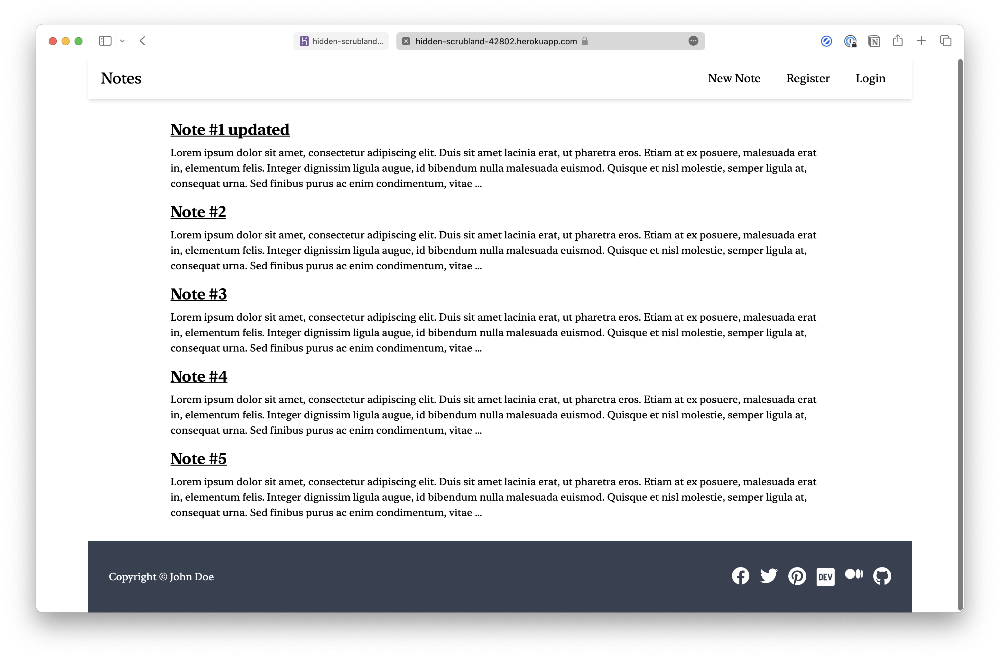

# Django Notes

A Django note-taking application built to demonstrate logging with Heroku.

**Tutorial**: [How to Start Logging With Heroku](https://betterstack.com/community/guides/logging/how-to-start-logging-with-heroku/).



## 🟢 Prerequisites

You must have the latest version of [Python 3](https://www.python.org) installed on your machine. This project is tested against Python 3.10.0.

Since this project is designed to be hosted on Heroku, you need to make sure [Git CLI](https://git-scm.com/book/en/v2/Getting-Started-Installing-Git) and [Heroku CLI](https://devcenter.heroku.com/articles/getting-started-with-python#set-up) are installed on your computer, and also make sure you have a verified Heroku account.

## 📦 Getting started

- Clone the project to your local disk:

  ```command
  git clone https://github.com/betterstack-community/heroku-notes.git
  ```

- Change into the project directory:

  ```command
  cd heroku-notes
  ```

- Log into your Heroku account:

  ```command
  heroku login
  ```

- Create a new Heroku app:

  ```command
  heroku create
  ```

  This command will generate a Heroku app with a random name, and the output will display its name, the domain this app is hosted on, and the remote repository associated with the app.

  ```text
  [output]
  Creating app... done, ⬢ hidden-scrubland-42802
  https://hidden-scrubland-42802.herokuapp.com/ | https://git.heroku.com/hidden-scrubland-42802.git
  ```

- Copy the domain name and add it to the `ALLOWED_HOSTS` in the `settings.py` file:

  ```python
  [label herokunotes/settings.py]
  . . .
  ALLOWED_HOSTS = ['<app_domain>']
  ```

- To deploy the app to Heroku, remove the original Git repository and run the following command:

  ```command
  git add .
  ```

  ```command
  git commit -m "initial commit"
  ```

  ```command
  git push heroku main
  ```

- Make sure that at least one instance of the app is running:

  ```command
  heroku ps:scale web=1
  ```

- And finally, open the app with the following command:

  ```command
  heroku open
  ```

## ⚖ License

The code used in this project and in the linked tutorial are licensed under the [Apache License, Version 2.0](LICENSE).
