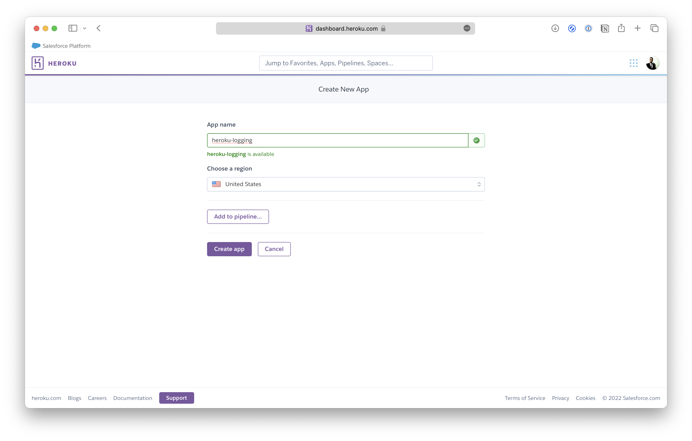

# Django Notes

A Django note-taking application built to demonstrate logging with Heroku.

**Tutorial**: [How to Start Logging With Heroku](https://betterstack.com/community/guides/logging/how-to-start-logging-with-heroku/).

## 🟢 Prerequisites

This project is designed to be hosted on Heroku, you need to make sure [Git CLI](https://git-scm.com/book/en/v2/Getting-Started-Installing-Git) and [Heroku CLI](https://devcenter.heroku.com/articles/getting-started-with-python#set-up) are installed on your computer, and also make sure you have a verified Heroku account.

## 📦 Getting started

To deploy this app, you need to create a new Heroku application first.

Next, create a fork for this repository.

Link the forked repository to the Heroku app.

And finally, deploy the `main` branch and you'll be good to go.

## ⚖ License

The code used in this project and in the linked tutorial are licensed under the [Apache License, Version 2.0](LICENSE).
